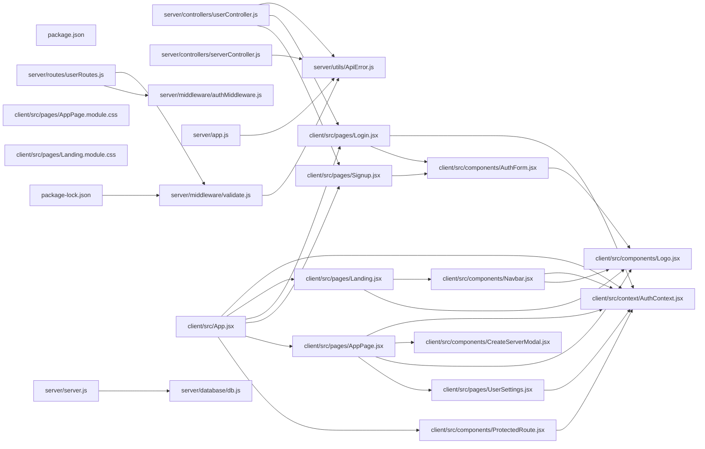

## ARCHITECTURE

A javascript-based project composed of the following subsystems:

- **client/**: Primary subsystem containing 30 files
- **server/**: Primary subsystem containing 21 files
- **Root**: Contains scripts and execution points

## ENTRY_POINTS

*No entry points identified within budget.*

## SYMBOL_INDEX

**`client/src/context/AuthContext.jsx`**
- `AuthProvider()`
- `useAuth()`

**`client/src/pages/AppPage.jsx`**
- `authHeaders()`
- `AppPage()`

**`client/src/pages/UserSettings.jsx`**
- `UserSettings()`

**`client/src/components/CreateServerModal.jsx`**
- `CreateServerModal()`

**`client/src/pages/Signup.jsx`**
- `Signup()`

**`client/src/pages/Login.jsx`**
- `Login()`

**`client/src/pages/Landing.jsx`**
- `Landing()`

**`client/src/components/AuthForm.jsx`**
- `AuthForm()`

**`server/utils/ApiError.js`**
- class `ApiError`
  - `constructor()`

**`server/controllers/serverController.js`**
- `generateInviteCode()`

**`server/middleware/validate.js`**
- `validate()`

**`client/src/components/Navbar.jsx`**
- `Navbar()`

**`server/middleware/authMiddleware.js`**
- `verifyToken()`

**`client/src/components/Logo.jsx`**
- `Logo()`

**`client/src/App.jsx`**
- `GuestRoute()`
- `InvitePage()`
- `AppRouter()`

## IMPORTANT_CALL_PATHS

server()
  → db.connectDB()
## CORE_MODULES

### `client/src/context/AuthContext.jsx`

**Purpose:** Implements AuthContext.

**Functions:**
- `function AuthProvider({ children })`
- `function useAuth()`

### `client/src/pages/AppPage.jsx`

**Purpose:** Implements AppPage.

**Functions:**
- `function AppPage()`
- `function authHeaders(token)`

**Notes:** large file (920 lines)

### `client/src/pages/UserSettings.jsx`

**Purpose:** Implements UserSettings.

**Functions:**
- `function UserSettings({ onClose })`

**Notes:** large file (787 lines)

### `server/controllers/userController.js`

**Purpose:** Implements userController.

### `client/src/components/CreateServerModal.jsx`

**Purpose:** Implements CreateServerModal.

**Functions:**
- `const CreateServerModal = ...`

**Notes:** large file (319 lines)

### `client/src/pages/Signup.jsx`

**Purpose:** Implements Signup.

**Functions:**
- `function Signup()`

## SUPPORTING_MODULES

### `client/src/pages/Login.jsx`

```javascript
function Login()

```

### `client/src/pages/Landing.jsx`

```javascript
function Landing()

```

### `client/src/components/AuthForm.jsx`

```javascript
function AuthForm(

```

### `server/utils/ApiError.js`

```javascript
class ApiError

```

### `client/src/pages/AppPage.module.css`

*1595 lines, 0 imports*

### `server/controllers/serverController.js`

```javascript
const generateInviteCode = ...

```

### `server/middleware/validate.js`

```javascript
const validate = ...

```

### `client/src/components/Navbar.jsx`

```javascript
function Navbar()

```

### `server/app.js`

*61 lines, 0 imports*

### `server/middleware/authMiddleware.js`

```javascript
const verifyToken = ...

```

### `client/src/components/Logo.jsx`

```javascript
function Logo({ size = 24, light = false })

```

### `client/src/App.jsx`

```javascript
function GuestRoute({ children })

function InvitePage()

function AppRouter()

```

### `client/src/pages/Landing.module.css`

*929 lines, 0 imports*

### `server/server.js`

*78 lines, 0 imports*

### `README.md`

*204 lines, 0 imports*

### `server/routes/userRoutes.js`

*21 lines, 0 imports*

## DEPENDENCY_GRAPH



## RANKED_FILES

| File | Score | Tier | Tokens |
|------|-------|------|--------|
| `client/src/context/AuthContext.jsx` | 0.562 | structured summary | 36 |
| `client/src/pages/AppPage.jsx` | 0.550 | structured summary | 44 |
| `client/src/pages/UserSettings.jsx` | 0.513 | structured summary | 38 |
| `server/controllers/userController.js` | 0.490 | structured summary | 15 |
| `client/src/components/CreateServerModal.jsx` | 0.419 | structured summary | 40 |
| `client/src/pages/Signup.jsx` | 0.418 | structured summary | 25 |
| `package.json` | 0.413 | one-liner | 10 |
| `package-lock.json` | 0.412 | one-liner | 12 |
| `client/src/pages/Login.jsx` | 0.406 | signatures | 16 |
| `client/src/pages/Landing.jsx` | 0.403 | signatures | 17 |
| `client/src/components/AuthForm.jsx` | 0.394 | signatures | 18 |
| `server/utils/ApiError.js` | 0.390 | signatures | 18 |
| `client/src/pages/AppPage.module.css` | 0.352 | signatures | 19 |
| `server/controllers/serverController.js` | 0.340 | signatures | 19 |
| `server/middleware/validate.js` | 0.340 | signatures | 18 |
| `client/src/components/Navbar.jsx` | 0.329 | signatures | 17 |
| `server/app.js` | 0.328 | signatures | 14 |
| `server/middleware/authMiddleware.js` | 0.318 | signatures | 19 |
| `client/src/components/Logo.jsx` | 0.286 | signatures | 26 |
| `client/src/App.jsx` | 0.280 | signatures | 26 |
| `client/src/pages/Landing.module.css` | 0.279 | signatures | 18 |
| `server/server.js` | 0.246 | signatures | 14 |
| `README.md` | 0.245 | signatures | 13 |
| `server/routes/userRoutes.js` | 0.235 | signatures | 16 |
| `server/database/db.js` | 0.222 | one-liner | 16 |
| `client/src/components/ProtectedRoute.jsx` | 0.220 | one-liner | 23 |
| `client/src/components/AuthForm.module.css` | 0.211 | one-liner | 15 |
| `client/src/components/EditServerModal.jsx` | 0.210 | one-liner | 23 |
| `client/package-lock.json` | 0.206 | one-liner | 13 |
| `client/package.json` | 0.206 | one-liner | 11 |
| `client/src/index.css` | 0.205 | one-liner | 12 |
| `client/src/pages/OAuthCallback.jsx` | 0.202 | one-liner | 23 |
| `client/src/components/JoinServerModal.jsx` | 0.197 | one-liner | 24 |
| `server/utils/cloudinaryHelper.js` | 0.190 | one-liner | 18 |
| `client/vite.config.js` | 0.171 | one-liner | 17 |
| `client/src/components/Navbar.module.css` | 0.158 | one-liner | 15 |
| `server/routes/serverRoutes.js` | 0.150 | one-liner | 13 |
| `server/middleware/errorMiddleware.js` | 0.140 | one-liner | 18 |
| `server/routes/authRoutes.js` | 0.126 | one-liner | 13 |
| `server/config/passport.js` | 0.122 | one-liner | 13 |

## PERIPHERY

- `package.json` — 40 lines
- `package-lock.json` — 2600 lines
- `server/database/db.js` — 2 functions, 29 lines
- `client/src/components/ProtectedRoute.jsx` — 1 function, 2 imports, 18 lines
- `client/src/components/AuthForm.module.css` — 349 lines
- `client/src/components/EditServerModal.jsx` — 1 function, 2 imports, 122 lines
- `client/package-lock.json` — 3568 lines
- `client/package.json` — 32 lines
- `client/src/index.css` — 51 lines
- `client/src/pages/OAuthCallback.jsx` — 1 function, 3 imports, 67 lines
- `client/src/components/JoinServerModal.jsx` — 1 function, 2 imports, 82 lines
- `server/utils/cloudinaryHelper.js` — 2 functions, 47 lines
- `client/vite.config.js` — 2 imports, 19 lines
- `client/src/components/Navbar.module.css` — 107 lines
- `server/routes/serverRoutes.js` — 54 lines
- `server/middleware/errorMiddleware.js` — 2 functions, 40 lines
- `server/routes/authRoutes.js` — 64 lines
- `server/config/passport.js` — 70 lines
- `server/validations/serverSchemas.js` — 48 lines
- `client/src/pages/UserSettings.module.css` — 709 lines
- `nodemon.json` — 8 lines
- `client/src/main.jsx` — 5 imports, 14 lines
- `server/models/Message.js` — 43 lines
- `server/models/Server.js` — 52 lines
- `server/routes/uploadRoutes.js` — 39 lines
- `server/validations/userSchemas.js` — 59 lines
- `server/utils/catchAsync.js` — 1 function, 6 lines
- `server/models/User.js` — 39 lines
- `client/index.html` — 14 lines
- `client/src/components/CreateServerModal.module.css` — 485 lines
- `client/public/favicon.svg` — 6 lines
- `client/README.md` — 17 lines
- `client/eslint.config.js` — 5 imports, 30 lines