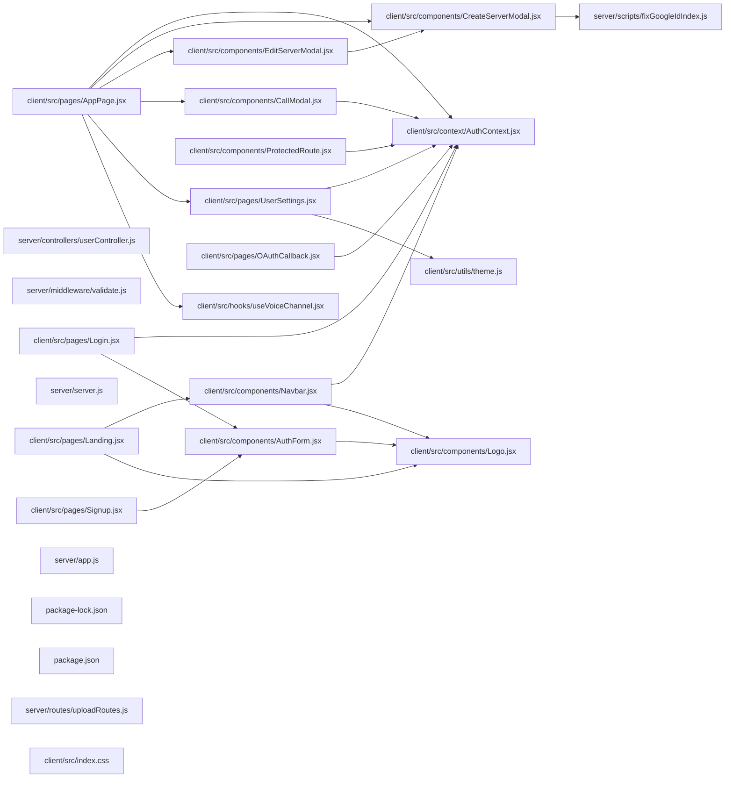

## ARCHITECTURE

A javascript-based project composed of the following subsystems:

- **client/**: Primary subsystem containing 35 files
- **server/**: Primary subsystem containing 30 files
- **Root**: Contains scripts and execution points

## ENTRY_POINTS

*No entry points identified within budget.*

## SYMBOL_INDEX

**`client/src/pages/AppPage.jsx`**
- `authHeaders()`
- `AppPage()`

**`client/src/pages/UserSettings.jsx`**
- `UserSettings()`

**`client/src/context/AuthContext.jsx`**
- `AuthProvider()`
- `useAuth()`

**`client/src/components/CallModal.jsx`**
- `CallModal()`

**`client/src/components/CreateServerModal.jsx`**
- `CreateServerModal()`

**`client/src/components/AuthForm.jsx`**
- `AuthForm()`

**`server/middleware/validate.js`**
- `validate()`

**`client/src/pages/Landing.jsx`**
- `Landing()`

**`client/src/pages/Signup.jsx`**
- `Signup()`

**`client/src/components/Navbar.jsx`**
- `Navbar()`

**`client/src/components/Logo.jsx`**
- `Logo()`

**`client/src/pages/Login.jsx`**
- `Login()`

**`client/src/utils/theme.js`**
- `applyTheme()`
- `saveTheme()`
- `loadSavedTheme()`

**`client/src/components/ProtectedRoute.jsx`**
- `ProtectedRoute()`

**`client/src/components/EditServerModal.jsx`**
- `EditServerModal()`

**`server/routes/uploadRoutes.js`**
- `getResourceType()`

**`client/src/pages/OAuthCallback.jsx`**
- `OAuthCallback()`

**`client/src/hooks/useVoiceChannel.jsx`**
- `useVoiceChannel()`

**`client/src/components/JoinServerModal.jsx`**
- `JoinServerModal()`

**`client/src/App.jsx`**
- `GuestRoute()`
- `InvitePage()`
- `AppRouter()`

**`server/controllers/dmController.js`**
- `normalizeParticipants()`
- `ensureFriendship()`

**`server/database/db.js`**
- `connectDB()`
- `getDB()`

## IMPORTANT_CALL_PATHS

server()
  → db.connectDB()
## CORE_MODULES

### `client/src/pages/AppPage.jsx`

**Purpose:** Implements AppPage.

**Functions:**
- `function AppPage()`
- `function authHeaders(token)`

**Notes:** large file (2212 lines)

### `client/src/pages/UserSettings.jsx`

**Purpose:** Implements UserSettings.

**Functions:**
- `function UserSettings({ onClose })`

**Notes:** large file (1429 lines)

### `client/src/context/AuthContext.jsx`

**Purpose:** Implements AuthContext.

**Functions:**
- `function AuthProvider({ children })`
- `function useAuth()`

### `server/controllers/userController.js`

**Purpose:** Implements userController.

### `client/src/components/CallModal.jsx`

**Purpose:** Implements CallModal.

**Functions:**
- `function CallModal(`

**Notes:** large file (800 lines)

### `client/src/components/CreateServerModal.jsx`

**Purpose:** Implements CreateServerModal.

**Functions:**
- `const CreateServerModal = ...`

**Notes:** large file (319 lines)

### `client/src/components/AuthForm.jsx`

**Purpose:** Implements AuthForm.

**Functions:**
- `function AuthForm(`

### `server/middleware/validate.js`

**Purpose:** Implements validate.

**Functions:**
- `const validate = ...`

### `client/src/pages/Landing.jsx`

**Purpose:** Implements Landing.

**Functions:**
- `function Landing()`

## SUPPORTING_MODULES

### `server/server.js`

*265 lines, 0 imports*

### `client/src/pages/Signup.jsx`

```javascript
function Signup()

```

### `client/src/components/Navbar.jsx`

```javascript
function Navbar()

```

### `client/src/components/Logo.jsx`

```javascript
function Logo({ size = 24, light = false })

```

### `client/src/pages/Login.jsx`

```javascript
function Login()

```

### `server/app.js`

*65 lines, 0 imports*

### `README.md`

*446 lines, 0 imports*

### `client/src/utils/theme.js`

```javascript
function applyTheme(themeId)

function saveTheme(themeId)

function loadSavedTheme()

```

### `client/src/components/ProtectedRoute.jsx`

```javascript
function ProtectedRoute({ children })

```

### `client/src/components/EditServerModal.jsx`

```javascript
const EditServerModal = ...

```

### `server/routes/uploadRoutes.js`

```javascript
function getResourceType(mimeType = "")

```

### `client/src/pages/OAuthCallback.jsx`

```javascript
function OAuthCallback()

```

### `client/src/index.css`

*64 lines, 0 imports*

### `client/src/hooks/useVoiceChannel.jsx`

```javascript
function useVoiceChannel(socket, roomId, isMuted, user)

```

### `client/src/components/JoinServerModal.jsx`

```javascript
function JoinServerModal({ onClose, onJoined })

```

### `client/src/pages/UserSettings.module.css`

*1080 lines, 0 imports*

### `client/src/App.jsx`

```javascript
function GuestRoute({ children })

function InvitePage()

function AppRouter()

```

### `server/controllers/dmController.js`

```javascript
const normalizeParticipants = ...

const ensureFriendship = ...

```

### `server/database/db.js`

```javascript
async function connectDB()

function getDB()

```

## DEPENDENCY_GRAPH



## RANKED_FILES

| File | Score | Tier | Tokens |
|------|-------|------|--------|
| `client/src/pages/AppPage.jsx` | 0.651 | structured summary | 45 |
| `client/src/pages/UserSettings.jsx` | 0.497 | structured summary | 39 |
| `client/src/context/AuthContext.jsx` | 0.473 | structured summary | 36 |
| `server/controllers/userController.js` | 0.381 | structured summary | 15 |
| `client/src/components/CallModal.jsx` | 0.364 | structured summary | 37 |
| `client/src/components/CreateServerModal.jsx` | 0.342 | structured summary | 40 |
| `server/scripts/fixGoogleIdIndex.js` | 0.329 | one-liner | 20 |
| `client/src/components/AuthForm.jsx` | 0.315 | structured summary | 26 |
| `server/middleware/validate.js` | 0.311 | structured summary | 26 |
| `client/src/pages/Landing.jsx` | 0.309 | structured summary | 25 |
| `server/server.js` | 0.308 | signatures | 14 |
| `client/src/pages/Signup.jsx` | 0.289 | signatures | 17 |
| `client/src/components/Navbar.jsx` | 0.288 | signatures | 17 |
| `client/src/components/Logo.jsx` | 0.283 | signatures | 26 |
| `client/src/pages/Login.jsx` | 0.282 | signatures | 16 |
| `server/app.js` | 0.273 | signatures | 14 |
| `package-lock.json` | 0.266 | one-liner | 11 |
| `package.json` | 0.266 | one-liner | 10 |
| `README.md` | 0.247 | signatures | 13 |
| `client/src/utils/theme.js` | 0.234 | signatures | 30 |
| `client/src/components/ProtectedRoute.jsx` | 0.228 | signatures | 21 |
| `client/src/components/EditServerModal.jsx` | 0.209 | signatures | 21 |
| `server/routes/uploadRoutes.js` | 0.205 | signatures | 20 |
| `client/src/pages/OAuthCallback.jsx` | 0.202 | signatures | 19 |
| `client/src/index.css` | 0.193 | signatures | 15 |
| `client/src/hooks/useVoiceChannel.jsx` | 0.182 | signatures | 29 |
| `client/src/components/JoinServerModal.jsx` | 0.182 | signatures | 26 |
| `client/src/pages/UserSettings.module.css` | 0.180 | signatures | 19 |
| `client/src/App.jsx` | 0.173 | signatures | 26 |
| `server/controllers/dmController.js` | 0.172 | signatures | 25 |
| `server/database/db.js` | 0.169 | signatures | 21 |
| `server/models/Message.js` | 0.167 | one-liner | 13 |
| `server/validations/serverSchemas.js` | 0.161 | one-liner | 16 |
| `client/src/main.jsx` | 0.152 | one-liner | 16 |
| `client/package-lock.json` | 0.145 | one-liner | 13 |
| `server/package-lock.json` | 0.140 | one-liner | 13 |
| `server/CONTEXT.md` | 0.133 | one-liner | 12 |
| `server/routes/authRoutes.js` | 0.128 | one-liner | 13 |
| `server/utils/ApiError.js` | 0.124 | one-liner | 18 |
| `server/utils/cloudinaryHelper.js` | 0.124 | one-liner | 18 |

## PERIPHERY

- `server/scripts/fixGoogleIdIndex.js` — 1 function, 47 lines
- `package-lock.json` — 330 lines
- `package.json` — 16 lines
- `server/models/Message.js` — 61 lines
- `server/validations/serverSchemas.js` — 51 lines
- `client/src/main.jsx` — 6 imports, 29 lines
- `client/package-lock.json` — 3587 lines
- `server/package-lock.json` — 2239 lines
- `server/CONTEXT.md` — 528 lines
- `server/routes/authRoutes.js` — 67 lines
- `server/utils/ApiError.js` — 1 class, 15 lines
- `server/utils/cloudinaryHelper.js` — 2 functions, 47 lines
- `server/config/passport.js` — 70 lines
- `client/src/pages/Landing.module.css` — 929 lines
- `server/routes/userRoutes.js` — 21 lines
- `client/CONTEXT.md` — 291 lines
- `client/package.json` — 34 lines
- `server/middleware/errorMiddleware.js` — 2 functions, 45 lines
- `server/models/DirectMessage.js` — 59 lines
- `server/routes/dmRoutes.js` — 13 lines
- `server/middleware/authMiddleware.js` — 1 function, 32 lines
- `server/models/Attachment.js` — 44 lines
- `server/models/User.js` — 66 lines
- `server/routes/serverRoutes.js` — 56 lines
- `client/src/components/Navbar.module.css` — 107 lines
- `client/src/components/AuthForm.module.css` — 349 lines
- `server/utils/catchAsync.js` — 1 function, 6 lines
- `client/index.html` — 14 lines
- `client/vite.config.js` — 2 imports, 19 lines
- `client/src/components/CallModal.module.css` — 431 lines
- `client/src/components/CreateServerModal.module.css` — 485 lines
- `server/package.json` — 34 lines
- `client/lint_results.json` — 2 lines
- `client/README.md` — 17 lines
- `server/controllers/friendController.js` — 159 lines
- `server/routes/friendRoutes.js` — 24 lines
- `nodemon.json` — 8 lines
- `client/public/favicon.svg` — 6 lines
- `server/models/Server.js` — 52 lines
- `client/eslint.config.js` — 5 imports, 30 lines
- `server/validations/userSchemas.js` — 59 lines

