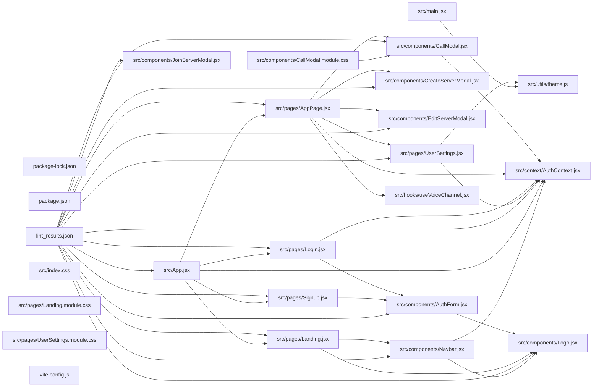

## ARCHITECTURE

A javascript-based project composed of the following subsystems:

- **src/**: Primary subsystem containing 26 files
- **public/**: Primary subsystem containing 1 files
- **Root**: Contains scripts and execution points

## ENTRY_POINTS

*No entry points identified within budget.*

## SYMBOL_INDEX

**`src/context/AuthContext.jsx`**
- `AuthProvider()`
- `useAuth()`

**`src/components/AuthForm.jsx`**
- `AuthForm()`

**`src/components/CallModal.jsx`**
- `CallModal()`

**`src/components/CreateServerModal.jsx`**
- `CreateServerModal()`

**`src/components/EditServerModal.jsx`**
- `EditServerModal()`

**`src/pages/AppPage.jsx`**
- `authHeaders()`
- `AppPage()`

**`src/pages/Landing.jsx`**
- `Landing()`

**`src/pages/Login.jsx`**
- `Login()`

**`src/pages/Signup.jsx`**
- `Signup()`

**`src/pages/UserSettings.jsx`**
- `UserSettings()`

**`src/utils/theme.js`**
- `applyTheme()`
- `saveTheme()`
- `loadSavedTheme()`

**`src/components/Logo.jsx`**
- `Logo()`

## IMPORTANT_CALL_PATHS

README()
## CORE_MODULES

### `src/context/AuthContext.jsx`

**Purpose:** Implements AuthContext.

**Functions:**
- `function AuthProvider({ children })`
- `function useAuth()`

### `README.md`

**Purpose:** Implements README.

### `src/components/AuthForm.jsx`

**Purpose:** Implements AuthForm.

**Functions:**
- `function AuthForm(`

### `src/components/CallModal.jsx`

**Purpose:** Implements CallModal.

**Functions:**
- `function CallModal(`

**Notes:** large file (800 lines)

## SUPPORTING_MODULES

### `src/components/CreateServerModal.jsx`

```javascript
const CreateServerModal = ...

```

### `src/components/EditServerModal.jsx`

```javascript
const EditServerModal = ...

```

### `src/pages/AppPage.jsx`

```javascript
function authHeaders(token)

function AppPage()

```

### `src/pages/Landing.jsx`

```javascript
function Landing()

```

### `src/pages/Login.jsx`

```javascript
function Login()

```

### `src/pages/Signup.jsx`

```javascript
function Signup()

```

### `src/pages/UserSettings.jsx`

```javascript
function UserSettings({ onClose })

```

### `src/utils/theme.js`

```javascript
function applyTheme(themeId)

function saveTheme(themeId)

function loadSavedTheme()

```

### `src/components/Logo.jsx`

```javascript
function Logo({ size = 24, light = false })

```

## DEPENDENCY_GRAPH



## RANKED_FILES

| File | Score | Tier | Tokens |
|------|-------|------|--------|
| `package-lock.json` | 0.501 | one-liner | 12 |
| `package.json` | 0.501 | one-liner | 10 |
| `src/context/AuthContext.jsx` | 0.426 | structured summary | 35 |
| `README.md` | 0.408 | structured summary | 11 |
| `src/components/AuthForm.jsx` | 0.258 | structured summary | 25 |
| `src/components/CallModal.jsx` | 0.258 | structured summary | 36 |
| `src/components/CreateServerModal.jsx` | 0.214 | signatures | 20 |
| `src/components/EditServerModal.jsx` | 0.214 | signatures | 20 |
| `src/pages/AppPage.jsx` | 0.214 | signatures | 22 |
| `src/pages/Landing.jsx` | 0.214 | signatures | 16 |
| `src/pages/Login.jsx` | 0.214 | signatures | 15 |
| `src/pages/Signup.jsx` | 0.214 | signatures | 16 |
| `src/pages/UserSettings.jsx` | 0.214 | signatures | 19 |
| `src/utils/theme.js` | 0.214 | signatures | 29 |
| `src/components/Logo.jsx` | 0.204 | signatures | 25 |
| `lint_results.json` | 0.200 | one-liner | 11 |
| `src/components/CallModal.module.css` | 0.200 | one-liner | 15 |
| `src/index.css` | 0.200 | one-liner | 11 |
| `src/main.jsx` | 0.200 | one-liner | 15 |
| `src/pages/Landing.module.css` | 0.200 | one-liner | 14 |
| `src/pages/UserSettings.module.css` | 0.200 | one-liner | 15 |
| `vite.config.js` | 0.200 | one-liner | 16 |
| `src/App.jsx` | 0.169 | one-liner | 19 |
| `src/components/JoinServerModal.jsx` | 0.169 | one-liner | 23 |
| `src/hooks/useVoiceChannel.jsx` | 0.144 | one-liner | 22 |
| `src/components/Navbar.jsx` | 0.115 | one-liner | 21 |
| `src/components/ProtectedRoute.jsx` | 0.115 | one-liner | 22 |
| `src/pages/OAuthCallback.jsx` | 0.115 | one-liner | 22 |
| `index.html` | 0.101 | one-liner | 10 |
| `public/favicon.svg` | 0.101 | one-liner | 11 |
| `src/components/AuthForm.module.css` | 0.101 | one-liner | 14 |
| `src/components/CreateServerModal.module.css` | 0.101 | one-liner | 15 |
| `src/components/Navbar.module.css` | 0.101 | one-liner | 14 |
| `eslint.config.js` | 0.100 | one-liner | 15 |

## PERIPHERY

- `package-lock.json` — 3587 lines
- `package.json` — 34 lines
- `lint_results.json` — 2 lines
- `src/components/CallModal.module.css` — 431 lines
- `src/index.css` — 64 lines
- `src/main.jsx` — 6 imports, 29 lines
- `src/pages/Landing.module.css` — 929 lines
- `src/pages/UserSettings.module.css` — 1080 lines
- `vite.config.js` — 2 imports, 19 lines
- `src/App.jsx` — 3 functions, 10 imports, 102 lines
- `src/components/JoinServerModal.jsx` — 1 function, 2 imports, 82 lines
- `src/hooks/useVoiceChannel.jsx` — 1 function, 1 imports, 508 lines
- `src/components/Navbar.jsx` — 1 function, 4 imports, 40 lines
- `src/components/ProtectedRoute.jsx` — 1 function, 2 imports, 18 lines
- `src/pages/OAuthCallback.jsx` — 1 function, 3 imports, 67 lines
- `index.html` — 14 lines
- `public/favicon.svg` — 6 lines
- `src/components/AuthForm.module.css` — 349 lines
- `src/components/CreateServerModal.module.css` — 485 lines
- `src/components/Navbar.module.css` — 107 lines
- `eslint.config.js` — 5 imports, 30 lines

