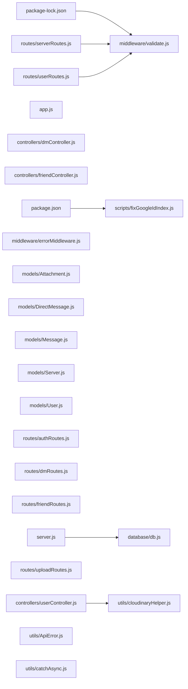

## ARCHITECTURE

A javascript-based project composed of the following subsystems:

- **routes/**: Primary subsystem containing 6 files
- **models/**: Primary subsystem containing 5 files
- **middleware/**: Primary subsystem containing 3 files
- **utils/**: Primary subsystem containing 3 files
- **Root**: Contains scripts and execution points

## ENTRY_POINTS

### `server.js`

```javascript
const path = require("path");
require("dotenv").config({ path: path.resolve(__dirname, ".env"), quiet: true });
const mongoose = require("mongoose");
const http = require("http");
const { Server } = require("socket.io");
const jwt = require("jsonwebtoken");
const app = require("./app");
const { connectDB } = require("./database/db");
const User = require("./models/User");

// Track user socket mappings: userId -> Set of socketIds
const userSockets = new Map();

// Track users in voice channels: channelId -> Map<socketId, userObj>
const voiceRooms = new Map();

// Handle connection errors after the initial connection
mongoose.connection.on("error", (err) => {
  console.error("❌ MongoDB runtime error:", err);
});

mongoose.connection.on("disconnected", () => {
  console.warn("⚠️ MongoDB connection lost.");
});

const PORT = process.env.PORT || 8000;

const httpServer = http.createServer(app);

const io = new Server(httpServer, {
  cors: {
    origin: ["http://localhost:5174", "http://127.0.0.1:5174"],
    credentials: true,
  },
});

app.set("io", io);


io.use(async (socket, next) => {
  const token = socket.handshake.auth?.token;
  if (!token) {
    return next(new Error("Authentication error: No token provided"));
  }

  try {
    const decoded = jwt.verify(token, process.env.JWT_SECRET);
    
    let user;
    if (typeof decoded.id === 'string' && decoded.id.length === 24) {
      // Legacy token with MongoDB _id
      user = await User.findById(decoded.id);
    } else {
      user = await User.findOne({ id: decoded.id });
    }

    if (user) {
      // Extract numeric id and avatarUrl
      socket.user = {
        id: user._doc?.id || user.id, // Ensure numeric ID
        username: user.username,
        avatarUrl: user.avatarUrl
      };
    } else {
      socket.user = decoded; // Fallback
    }
    
    next();
  } catch (err) {
    return next(new Error("Authentication error: Invalid token"));
  }
});

io.on("connection", async (socket) => {
  console.log(`🔌 New client connected: ${socket.id} (User: ${socket.user.username})`);

  // Store socket ID mapping
  const userId = socket.user.id;
  if (!userSockets.has(userId)) {
    userSockets.set(userId, new Set());
  }
  userSockets.get(userId).add(socket.id);

  // Update user's socketId in database
  await User.findOneAndUpdate({ id: userId }, { socketId: socket.id });

  // Tell THIS socket about ALL currently online users (including themselves)
  const onlineList = [];
  for (const [onlineUserId, socketSet] of userSockets.entries()) {
    if (socketSet.size > 0) {
      const activeSocketId = Array.from(socketSet)[0];
      onlineList.push({ userId: onlineUserId, socketId: activeSocketId });
    }
  }
  socket.emit("online-users-list", onlineList);
  console.log(`📡 Sent online-users-list to ${socket.user.username}:`, onlineList);

  // Tell EVERYONE ELSE this user is now online
  socket.broadcast.emit("user-online", { userId, socketId: socket.id });
  console.log(`📢 Broadcasted user-online for ${socket.user.username} (${userId})`);

  // Tell THIS socket about ALL active voice rooms
  for (const [cId, room] of voiceRooms.entries()) {
    socket.emit("voice-users-update", {
      channelId: cId,
      users: Array.from(room.values())
    });
  }

  socket.on("join_channel", (channelId) => {
    socket.join(channelId);
    console.log(`Socket ${socket.id} joined channel: ${channelId}`);
  });

  socket.on("leave_channel", (channelId) => {
    socket.leave(channelId);
    console.log(`Socket ${socket.id} left channel: ${channelId}`);
  });

  // Voice/Video Call Signaling
  socket.on("call-user", ({ userToCall, signalData, from, callType, isVoiceChannel }) => {
    // Use server-side verified username from JWT — never trust client-sent callerName
    io.to(userToCall).emit("call-incoming", {
      signal: signalData,
      from,
      callType: callType || 'audio',
      callerName: socket.user.username,
      callerAvatar: socket.user.avatarUrl,
      isVoiceChannel
    });
  });

  socket.on("accept-call", ({ signal, to, isVoiceChannel }) => {
    io.to(to).emit("call-accepted", { signal, from: socket.id, isVoiceChannel });
  });

  socket.on("reject-call", ({ to }) => {
    io.to(to).emit("call-rejected");
  });

  socket.on("end-call", ({ to }) => {
    io.to(to).emit("call-ended");
  });

  socket.on("ice-candidate", ({ candidate, to, isVoiceChannel }) => {
    io.to(to).emit("ice-candidate", { candidate, from: socket.id, isVoiceChannel });
  });

  socket.on("toggle-video", ({ to, isVideoOff }) => {
    io.to(to).emit("toggle-video", { isVideoOff });
  });

  socket.on("toggle-mute", ({ to, isMuted }) => {
    io.to(to).emit("toggle-mute", { isMuted });
  });

  socket.on("renegotiate", ({ to, signal }) => {
    io.to(to).emit("renegotiate", signal);
  });

  socket.on("renegotiate-mesh", ({ to, signal, from }) => {
    io.to(to).emit("renegotiate-mesh", { signal, from });
  });

  socket.on("toggle-screen-share", ({ to, isScreenSharing }) => {
    io.to(to).emit("toggle-screen-share", { isScreenSharing });
  });

  socket.on("join-voice", ({ channelId, user }) => {
    // Enforce exclusivity: Remove user from all other voice rooms
    for (const [cId, room] of voiceRooms.entries()) {
      for (const [sId, u] of room.entries()) {
        if (String(u.id) === String(user.id)) {
          const socketToRemove = io.sockets.sockets.get(sId);
          if (socketToRemove) {
            socketToRemove.leave(`voice-${cId}`);
            socketToRemove.emit("force-disconnect-voice");
          }
          room.delete(sId);
          io.emit("voice-users-update", {
            channelId: cId,
            users: Array.from(room.values())
          });
          socket.to(`voice-${cId}`).emit("user-left-voice", { channelId: cId, socketId: sId });
          if (room.size === 0) voiceRooms.delete(cId);
        }
      }
    }

    socket.join(`voice-${channelId}`);
    if (!user.socketId) user.socketId = socket.id;
    if (!voiceRooms.has(channelId)) voiceRooms.set(channelId, new Map());
    voiceRooms.get(channelId).set(socket.id, user);
    
    io.emit("voice-users-update", {
      channelId,
      users: Array.from(voiceRooms.get(channelId).values())
    });
    
    // Broadcast to others in the room to trigger WebRTC offers
    socket.to(`voice-${channelId}`).emit("user-joined-voice", { channelId, user });
  });

  socket.on("leave-voice", ({ channelId }) => {
    socket.leave(`voice-${channelId}`);
    if (voiceRooms.has(channelId)) {
      const room = voiceRooms.get(channelId);
      room.delete(socket.id);
      io.emit("voice-users-update", {
        channelId,
        users: Array.from(room.values())
      });
      socket.to(`voice-${channelId}`).emit("user-left-voice", { channelId, socketId: socket.id });
      if (room.size === 0) voiceRooms.delete(channelId);
    }
  });

  socket.on("disconnect", async () => {
    console.log(`🔌 Client disconnected: ${socket.id} (User: ${socket.user.username})`);
    
    for (const [channelId, room] of voiceRooms.entries()) {
      if (room.has(socket.id)) {
        room.delete(socket.id);
        io.emit("voice-users-update", {
          channelId,
          users: Array.from(room.values())
        });
        socket.to(`voice-${channelId}`).emit("user-left-voice", { channelId, socketId: socket.id });
        if (room.size === 0) voiceRooms.delete(channelId);
      }
    }

    const socketSet = userSockets.get(userId);
    if (socketSet) {
      socketSet.delete(socket.id);
      if (socketSet.size === 0) {
        console.log(`🛑 Removing active socket for ${socket.user.username} (${userId})`);
        userSockets.delete(userId);
        await User.findOneAndUpdate({ id: userId }, { socketId: null });
        socket.broadcast.emit("user-offline", { userId });
        console.log(`📢 Broadcasted user-offline for ${socket.user.username} (${userId})`);
      } else {
        console.log(`⚠️ Ignored disconnect for ${socket.user.username} (${socketSet.size} sockets remaining)`);
        const activeSocketId = Array.from(socketSet)[0];
        await User.findOneAndUpdate({ id: userId }, { socketId: activeSocketId });
        socket.broadcast.emit("user-online", { userId, socketId: activeSocketId });
      }
    }
    socket.broadcast.emit("user-left-call", { userId });
  });
});

// Connect to MongoDB Atlas first, then start the HTTP server
connectDB()
  .then(() => {
    httpServer.listen(PORT, () => {
      console.log(`🚀 Server running on port ${PORT}`);
    });
  })
  .catch((err) => {
    console.error("❌ Failed to connect to MongoDB Atlas:", err);
    process.exit(1);
  });

```

## SYMBOL_INDEX

**`middleware/validate.js`**
- `validate()`

**`database/db.js`**
- `connectDB()`
- `getDB()`

**`utils/cloudinaryHelper.js`**
- `getPublicIdFromUrl()`
- `deleteImage()`

**`controllers/dmController.js`**
- `normalizeParticipants()`
- `ensureFriendship()`

**`middleware/errorMiddleware.js`**
- `errorConverter()`
- `errorHandler()`

**`routes/uploadRoutes.js`**
- `getResourceType()`

**`utils/ApiError.js`**
- class `ApiError`
  - `constructor()`

**`utils/catchAsync.js`**
- `asyncHandler()`

## IMPORTANT_CALL_PATHS

server()
  → db.connectDB()
## CORE_MODULES

### `middleware/validate.js`

**Purpose:** Implements validate.

**Functions:**
- `const validate = ...`

## SUPPORTING_MODULES

### `database/db.js`

```javascript
async function connectDB()

function getDB()

```

### `utils/cloudinaryHelper.js`

```javascript
const getPublicIdFromUrl = ...

const deleteImage = ...

```

### `app.js`

*65 lines, 0 imports*

### `config/passport.js`

*70 lines, 0 imports*

### `controllers/dmController.js`

```javascript
const normalizeParticipants = ...

const ensureFriendship = ...

```

### `controllers/friendController.js`

*159 lines, 0 imports*

### `controllers/userController.js`

*281 lines, 0 imports*

### `middleware/errorMiddleware.js`

```javascript
const errorConverter = ...

const errorHandler = ...

```

### `models/Attachment.js`

*44 lines, 0 imports*

### `models/DirectMessage.js`

*59 lines, 0 imports*

### `models/Message.js`

*61 lines, 0 imports*

### `models/Server.js`

*52 lines, 0 imports*

### `models/User.js`

*66 lines, 0 imports*

### `routes/authRoutes.js`

*67 lines, 0 imports*

### `routes/dmRoutes.js`

*13 lines, 0 imports*

### `routes/friendRoutes.js`

*24 lines, 0 imports*

### `routes/serverRoutes.js`

*56 lines, 0 imports*

### `routes/uploadRoutes.js`

```javascript
function getResourceType(mimeType = "")

```

### `routes/userRoutes.js`

*21 lines, 0 imports*

### `utils/ApiError.js`

```javascript
class ApiError

```

### `utils/catchAsync.js`

```javascript
const asyncHandler = ...

```

### `validations/serverSchemas.js`

*51 lines, 0 imports*

### `validations/userSchemas.js`

*59 lines, 0 imports*

## DEPENDENCY_GRAPH



## RANKED_FILES

| File | Score | Tier | Tokens |
|------|-------|------|--------|
| `middleware/validate.js` | 0.500 | structured summary | 24 |
| `package-lock.json` | 0.400 | one-liner | 12 |
| `package.json` | 0.400 | one-liner | 10 |
| `server.js` | 0.326 | full source | 2159 |
| `database/db.js` | 0.283 | signatures | 20 |
| `scripts/fixGoogleIdIndex.js` | 0.233 | one-liner | 19 |
| `utils/cloudinaryHelper.js` | 0.233 | signatures | 26 |
| `app.js` | 0.100 | signatures | 13 |
| `config/passport.js` | 0.100 | signatures | 15 |
| `controllers/dmController.js` | 0.100 | signatures | 24 |
| `controllers/friendController.js` | 0.100 | signatures | 16 |
| `controllers/userController.js` | 0.100 | signatures | 15 |
| `middleware/errorMiddleware.js` | 0.100 | signatures | 21 |
| `models/Attachment.js` | 0.100 | signatures | 15 |
| `models/DirectMessage.js` | 0.100 | signatures | 16 |
| `models/Message.js` | 0.100 | signatures | 15 |
| `models/Server.js` | 0.100 | signatures | 15 |
| `models/User.js` | 0.100 | signatures | 14 |
| `routes/authRoutes.js` | 0.100 | signatures | 15 |
| `routes/dmRoutes.js` | 0.100 | signatures | 16 |
| `routes/friendRoutes.js` | 0.100 | signatures | 16 |
| `routes/serverRoutes.js` | 0.100 | signatures | 15 |
| `routes/uploadRoutes.js` | 0.100 | signatures | 19 |
| `routes/userRoutes.js` | 0.100 | signatures | 15 |
| `utils/ApiError.js` | 0.100 | signatures | 17 |
| `utils/catchAsync.js` | 0.100 | signatures | 18 |
| `validations/serverSchemas.js` | 0.100 | signatures | 17 |
| `validations/userSchemas.js` | 0.100 | signatures | 17 |
| `middleware/authMiddleware.js` | 0.000 | one-liner | 16 |

## PERIPHERY

- `package-lock.json` — 2239 lines
- `package.json` — 34 lines
- `scripts/fixGoogleIdIndex.js` — 1 function, 47 lines
- `middleware/authMiddleware.js` — 1 function, 32 lines

